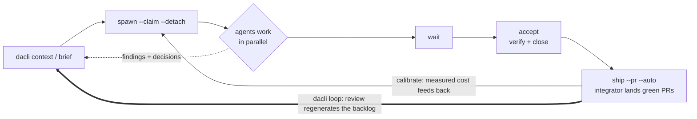

# dacli

<p align="center">
  
</p>

<p align="center"><strong>Your autonomous engineering team — set the direction; it plans, builds, reviews, and ships.</strong></p>

    

dacli is a disciplined swarm of specialized agents — implementers, reviewers, auditors, an integrator — that runs a repository the way a real engineering org does: sprints, PRs, code review, CI gates, retros. It self-hosts: **this tool built and hardened itself, across 80+ merged PRs**, tracked in its own `.dacli/` workspace (see [docs/SELFHOSTING.md](docs/SELFHOSTING.md)). The moat is governance — a loop that knows when to stop, review that audits its own code, trust/taint gates, calibrated budgets — which is what makes it safe to run unattended on real code.

```bash
brew install mlnomadpy/tap/dacli
```



> Markdown on disk, folders for structure, a CLI and an MCP server as the two front ends. Zero dependencies outside the Go standard library.

An agent that spawns subagents has one hard problem: **each child starts blind.** It re-reads the codebase, re-derives decisions its siblings already made, and re-attempts work that already failed. `dacli` is the shared workspace that fixes this — a durable, human-readable project state that any agent in the tree can query, and that the parent can slice down to exactly the context a given child needs.

Everything is markdown with YAML frontmatter and `[[wikilinks]]`. That means git diffs it, `grep` searches it, GitHub renders it, Obsidian opens the workspace as a vault with no plugin, and you can fix it by hand when an agent writes something stupid.

## What you get

|  | |
|---|---|
| 🧠 **Context on tap** | `dacli context <task> --budget N` returns one self-contained, token-budgeted brief — task, goal, constraints, prior decisions, siblings' findings — instead of the whole repo. |
| 🚀 **A real agent fleet** | `spawn` launches child coding-agent CLIs; `--claim` reserves disjoint files; `--detach` + `wait` run them async; `accept` closes a task after verifying it; `ship` ties off a whole wave. |
| 📊 **Measures its own cost** | `calibrate` learns each *role × model × runtime*'s real cost — in **tokens**, not guesses — then `spawn --advise` / `--max-tokens` size and gate the next launch by it. |
| 🛡️ **Trust & safety gates** | Every brief carries a **trust-floor**; `taint` refuses to spawn onto an injected source's blast radius; a `--claim` conflict is refused before it can clobber a sibling. |
| 🔎 **Resource-safe** | `agents` shows each live tree's RAM/CPU/GPU + last transcript line; `kill` reaps the whole process group — no runaway agents. |
| 🔗 **GitHub, both ways** | `github push` mirrors tasks→issues, decisions→issues, findings→issues (severity-labeled); `github pull` adopts issues as tasks — all behind a disclosure gate. |
| 📓 **Everything recorded** | Every run freezes its brief, invocation, transcript, and outcome; every commit is attributed to the agent and role that authored it. |

## The perpetual loop — a team that runs itself

The loop pictured in the hero above — `context → spawn → wait → accept → ship`, feeding back through `calibrate` — is the whole product in one diagram.

```bash
dacli loop --project core --width 3 --max-cycles 5     # bounded: 5 sprints, then stop
dacli loop --project core --window-tokens 2000000 --yolo   # perpetual, budget-governed
```

`dacli loop` runs the whole software process as a governed cycle — **review → plan → implement → test → land → retro**, then around again — with no human in the loop. Each cycle spawns implementers on the ready backlog (`spawn --pr --detach`), waits, lands green PRs (`dacli pr --auto`, backstopped by the standing **integrator** role), then spawns a reviewer whose only job is to file the *next* evidence-based improvement as fresh work. That review phase is the engine: it regenerates the backlog, so the loop feeds itself. The whole cycle, phase by phase, is traced in [docs/WALKTHROUGH.md § 9](docs/WALKTHROUGH.md#9-zooming-out-the-perpetual-loop); the integrator's row is in [docs/ROSTER.md](docs/ROSTER.md).

What keeps it a maintenance team and not a runaway refactor is the **governor** — a pure decision engine every cycle passes through ([docs/WALKTHROUGH.md § 9](docs/WALKTHROUGH.md#9-zooming-out-the-perpetual-loop)):

- **Empty backlog → idle, never invent.** No evidence-based work means it sleeps and re-scans, it does not manufacture busywork.
- **Token budget window.** `--window-tokens N --budget-window 24h` caps spend per rolling window; exhaust it and the loop sleeps until the window resets.
- **Thrash guard.** N consecutive cycles that land nothing halts the loop (`--no-progress-halt`, default 3) — no infinite oscillation.
- **Kill switch.** `touch .dacli/STOP` halts at the next checkpoint; between cycles the loop pauses for you unless you pass `--yolo`.

An unbounded run with *no* stop condition is refused — you set `--max-cycles`, keep the thrash guard on, or explicitly opt into `--yolo`. Preview any configuration without spawning a single agent: `dacli loop --dry-run`.

## The core idea

```bash
dacli context task/042 --budget 4000
```

One command returns a single self-contained markdown brief: the task, the goal it serves, the constraints that bound it, the decisions already made that it must not relitigate, and the findings its siblings have reported — trimmed to fit a token budget, most-relevant-first.

You hand that to a subagent instead of the whole repo. That is the product. Task tracking is the substrate that makes it possible.

## Status

**Alpha — the compound loop is shipped.** The organize layer (v0) and the compound layer (v1) are both working: tasks, decisions/findings/metrics, risks, glossary, queues, the append-only event log and `sync`, `context` with budget trimming, the full SPM readout (`lint`, `estimate`, `critical-path`, `next`, `wbs`, `burndown`, `velocity`), and **`dacli mcp serve`** — the whole tool surface over MCP stdio, with policy refusals returned as results so no client retry-loop ever hammers a "no". Zero dependencies outside the Go standard library.

The agent-fleet layer is real, not spec: `spawn` launches child coding-agent CLIs (declared adapters, probed by `runtime doctor`), `wait` blocks on detached runs, `supervise` runs the spawn→evaluate→correct loop, `verify` seats an adversarial panel, `accept` closes a task after verifying its acceptance, and `ship` ties off a whole wave. Alongside it: `calibrate` (measure a role×model×runtime's real cost), the `taint` gate (refuse to spawn onto a brief in an injected source's blast radius), and the `github` mirror (tasks↔issues, decisions, findings). Every run is recorded: frozen brief, redacted invocation, transcript, outcome.

Two commands are still honest stubs that refuse with an explanation: `skill promote` and `shortcut promote` — both wait on an un-promoted object to promote from. The format spec is the stable part; treat the Go API as unstable.

The docs index — every document, one line each, with an honest status label — is [docs/README.md](docs/README.md). Start with [DESIGN.md](DESIGN.md) for the why, [docs/ARCHITECTURE.md](docs/ARCHITECTURE.md) for the normative shape (axioms, layers, build order, the canonical brief), and [docs/WALKTHROUGH.md](docs/WALKTHROUGH.md) to watch one task travel the whole system end to end.

## Three surfaces, one store

- **Obsidian** is where humans read and write documents.
- **GitHub** is where humans coordinate and work becomes visible outside the session.
- **`dacli`** (CLI and MCP) is where agents work.

One markdown store underneath. None of them owns it. GitHub is a *projection* that can be deleted and regenerated — local markdown stays the source of truth, because `dacli context` is the hot path and must never touch the network.

## Install

**Homebrew** (macOS/Linux):

```bash
brew install mlnomadpy/tap/dacli
```

**Direct download** — prebuilt darwin/linux/windows binaries (amd64+arm64) are attached to each [GitHub release](https://github.com/mlnomadpy/dacli/releases):

```bash
curl -sSL https://github.com/mlnomadpy/dacli/releases/latest/download/dacli_<version>_<os>_<arch>.tar.gz | tar xz
```

**From source** (requires Go 1.22+):

```bash
go install github.com/mlnomadpy/dacli/cmd/dacli@latest
```

## Quickstart

```bash
# In your project root
dacli init --name "payments-refactor"

dacli project add "Migrate billing to the new ledger" --slug ledger
dacli task add "Audit every write path into balances" --project ledger
dacli note add decision "Ledger writes stay synchronous" --project ledger \
  --body "Async was rejected: reconciliation cost exceeds the latency win."

# Parent agent mints a read-only child identity
TOKEN=$(dacli agent spawn --role auditor --grant ro)

# Child agent, in its own process
DACLI_AGENT=$TOKEN dacli context task/001 --budget 3000
DACLI_AGENT=$TOKEN dacli status
```

## Capabilities

Four loops sit on top of the store. Each observes the durable log rather than inventing new state.

**The agent-fleet loop — spawn → wait → accept → ship.** A parent mints a child identity and launches a real coding-agent CLI on a task:

```bash
dacli spawn --task 042 --role auditor --grant ro --claim internal/billing --detach
dacli wait                      # block until detached run(s) finish, then finalize outcome
dacli accept 042 --verify "go test ./..."   # verify acceptance, check the boxes, close — one owner step
dacli ship --into main --push   # accept all proposed, integrate their branches, record, push
```

`spawn` delivers the frozen brief on stdin or as an arg, rides the token in the environment, applies the grant through the runtime's own sandbox flags — and a runtime that cannot enforce read-only *refuses*, never silently downgrades (`--cooperative` overrides loudly). `--claim <path>` scopes the child to a subtree (and refuses a path-claim conflict with a live sibling); `--detach` backgrounds it so a parent can fan out a wave and `wait` on all of them. `agents`, `logs -f`, and `kill` observe and reap the live process trees.

**Calibration — measure the cost, then advise, then enforce.** `calibrate` joins every completed task to the run that finished it and reports the empirical multiplier (and, where the runtime reports usage, tokens/point) by `role × model × runtime` band; a band with n≥10 samples is authoritative. That measurement then acts on the next spawn: `spawn --advise` prints the suggested budget from the calibrated band before launch, and `spawn --max-tokens N` *refuses* (exit 3) a spawn whose band-expected cost exceeds `N` unless `--force`. Estimation inverts once a band is dense: the empirical distribution becomes the estimate and the PERT three-point becomes the prior.

**The trust & taint gates.** Findings carry a `trust:` grade (`confirmed` / `unverified` / `refuted`); `verify` seats an adversarial panel — one refuter per runtime — and grades a finding *before* it enters a sibling's brief, and every brief prints a `trust-floor` line = the worst grade among the findings it surfaces. `taint` traces the blast radius of a suspect source over event and note origins; because a `--scope workspace` note reaches every project's brief, `spawn` treats taint as a *gate*, not just an audit query — it refuses to launch a child onto a brief in an external source's blast radius unless `--force`/`--cooperative`.

**The GitHub mirror.** GitHub is a projection, never the source of truth. `github push` mirrors tasks to issues (with finding notes as comments and decision notes as their own issues), idempotent by an embedded marker so a retried sync converges without duplicates; `github pull` adopts human-authored issues back as local tasks; `github sync` is pull-then-push. `pr` opens a task's PR with acceptance + findings + `Fixes #issue` in the body, and `--with-verdicts` posts the verify panel's verdicts as a PR review.

## Command reference

The full shipped surface, grouped. Run `dacli help` for the flat list; every command takes `--json` on its read paths.

**Workspace & onboarding**

| Command | Purpose |
|---|---|
| `dacli init` | Create a `.dacli` workspace (`--template` seeds a process, `--roster` seeds roles) |
| `dacli adopt` | Onboard an existing repo: init, project, codebase map, TODO tasks |
| `dacli whoami` | Show the acting agent and its grant |
| `dacli overview` | Human-first summary: projects, activity, ready-now tasks |
| `dacli status` | Tree-wide project state in one screen |
| `dacli doctor` | Detect management anti-patterns in tasks, risks, and the log |
| `dacli version` | Print the dacli version |

**Planning — projects, tasks, risks**

| Command | Purpose |
|---|---|
| `dacli project add\|list\|show` | Create, list, show projects |
| `dacli task add\|list\|show` | Create, list, show tasks |
| `dacli task claim\|check\|done\|block` | Take ownership, check acceptance boxes, close (verifies, refuses if unmet), block |
| `dacli risk add\|list` | Record and rank risks in the impact × likelihood matrix |
| `dacli wbs` | Work breakdown tree (`task add --parent` builds it) |
| `dacli glossary` | Show or edit the project term list |

**Context & knowledge**

| Command | Purpose |
|---|---|
| `dacli context <ref>` | **Assemble a scoped context brief for an agent — the main event** |
| `dacli note add` | Record a decision, finding, metric, or reference |
| `dacli retro` | Harvest a task/project: went well, didn't, improve |
| `dacli prompt list\|show` | The prompt registry and one prompt's resolved template |

**Collaboration & the event log**

| Command | Purpose |
|---|---|
| `dacli sync` | Apply pending child events to objects you own |
| `dacli events tail` | Follow the append-only write log |
| `dacli ask` / `answer` / `threads` | Ask a blocking question, answer it (becomes a durable note), list threads |
| `dacli escalate` | Escalate out of the tree to a human (`--github` files an issue) |

**SPM & insight**

| Command | Purpose |
|---|---|
| `dacli lint` | Format, INVEST, requirements-quality, and ambiguity checks |
| `dacli next` | What to work on now: MoSCoW, then critical path (`--parallel N`) |
| `dacli estimate` | PERT three-point estimate widened by the Cone of Uncertainty |
| `dacli critical-path` | CPM: full schedule with slack; a star marks the critical path |
| `dacli burndown` / `velocity` | Points remaining vs done; completions per active day |
| `dacli standup` | Per-agent roll-up: done, doing, impediments — derived, never filed |
| `dacli calibrate` | Te vs actuals: the empirical multiplier by size and agent band |
| `dacli taint` | Blast radius of a suspect source over event/note origins |

**Teams & roles**

| Command | Purpose |
|---|---|
| `dacli agent spawn\|tree\|retire` | Mint a child identity, show lineage + attribution, free a WIP slot |
| `dacli role add\|list` | Define a role (skills, scope, shortcuts, escalation); list roles |
| `dacli team` / `team route` | Roster with WIP headroom; who owns a path and the chain to reach them |

**Shortcuts & queues**

| Command | Purpose |
|---|---|
| `dacli shortcut add` | Define a shortcut (a memoized, effect-gated command template) |
| `dacli run` | Expand and run a shortcut (`--dry-run`, `--confirm`, `--list`) |
| `dacli queue add\|list\|next\|advance` | Ordered step lists with owned cursors (`advance --fail` halts) |

**The agent fleet — runtimes, spawn, supervise, verify**

| Command | Purpose |
|---|---|
| `dacli runtime add\|list\|doctor` | Declare a coding-agent CLI adapter; list; probe the install |
| `dacli spawn` | Launch a child on a runtime: identity, brief, sandbox, run record (`--detach`, `--claim`, `--advise`, `--max-tokens`) |
| `dacli wait` | Block until detached run(s) finish, then finalize their outcome |
| `dacli supervise` | Spawn-evaluate-correct loop until accepted or `--max-turns` |
| `dacli verify` | Adversarial panel: one refuter per runtime; tally derived from the log |
| `dacli accept` | Verify an agent's completion and close the task in one owner step |
| `dacli agents` | Live spawned agents + RAM/CPU/GPU (`--tail`, `--reap`) |
| `dacli logs` | Print or follow (`-f`) a run's transcript as it streams |
| `dacli kill` | Terminate an agent and its entire process tree (SIGTERM→SIGKILL) |
| `dacli runs list\|show\|prune` | Recorded runs; one run's detail; bound transcript growth |
| `dacli replay` | Reconstruct a run as brief + events interleaved (offline) |

**Skills, templates & stage gates**

| Command | Purpose |
|---|---|
| `dacli skill add\|list\|show` | Author a workspace skill; list with delivery floors; show one |
| `dacli skill import\|fetch\|compile` | Ingest a native skill tree; fetch from skills.sh; materialize for a role×runtime |
| `dacli template list\|show\|add` | Project templates, their stages/gates, vendor one for editing |
| `dacli stage` / `stage advance` | Current stage + gate status; advance if the gate opens |

**Version control, shipping & the GitHub mirror**

| Command | Purpose |
|---|---|
| `dacli commit` | Commit as yourself: author = agent (role), with dacli trailers |
| `dacli blame` / `contrib` | Who wrote each line; per-role/per-agent contribution rollup |
| `dacli worktree add\|list\|remove` | Isolated worktree+branch per task so parallel agents don't collide |
| `dacli push` / `pr` / `merge` | Push a branch; open a PR (acceptance + findings + `Fixes #`); merge (a conflict blocks, never half-merges) |
| `dacli integrate` | Merge task branches (`--tasks` or all done) into `--into`, cleaning up |
| `dacli ship` | One wave tail: accept, integrate, record the `.dacli` state, optionally push |
| `dacli github doctor\|link\|push\|pull\|sync` | Probe gh/auth; bind a project; mirror tasks↔issues both ways |

**Serving & self-report**

| Command | Purpose |
|---|---|
| `dacli mcp serve` | Serve the workspace as MCP tools over stdio |
| `dacli report` | File a dacli-tool bug upstream via gh (explicit; never automatic) |

Still stubbed (each refuses with an explanation): `dacli skill promote`, `dacli shortcut promote`.

## Teams and shortcuts

**Roles** organize the tree — and the rule that keeps them from being cosplay is that *a role must change what an agent can do, not just what it calls itself*. A role determines which skills load at spawn, which paths are in scope, which shortcuts are reachable, and who to escalate to. It also carries a Kanban WIP limit, so `spawn` refuses the thirty-children-over-four-files situation up front instead of `doctor` diagnosing it after.

**Escalation is a typed help request, not a chat channel** — a deliberate reversal of the obvious design, argued in [docs/TEAM.md § 3](docs/TEAM.md). Agents are agreeable, so two of them "discussing" converge without adding information; a conversation has no completion criterion, which is disqualifying in a budget-aware tool; and chat is ephemeral in a system whose whole thesis is durability. The question is transient, the answer becomes a decision note and enters every future brief. The chain terminates at `human` — a tree that can't say "nobody here owns this" will have somebody guess instead.

## Runtimes

`dacli` spawns its agents by invoking coding-agent CLIs (Claude Code, Codex, Gemini CLI, opencode, …) and supervising them against a task's acceptance criteria. Design in [docs/RUNTIMES.md](docs/RUNTIMES.md). The decisions that matter:

- **Results come back through the workspace, not stdout.** Children report by calling `dacli`, so results are format-independent, uniformly attributed, and *survive the child being killed mid-run* — which is exactly when partial work is most valuable. Parsing each vendor's output format would make schema-chasing the permanent central problem.
- **Adapters are declarative files, probed rather than trusted.** `dacli runtime doctor` verifies each adapter's assumed flags against the installed binary. Shipped flag sets are starting points, not facts.
- **Spawning makes permissions genuinely enforced** for spawned children, since `dacli` sets the runtime's own sandbox flags. A runtime that can't enforce read-only causes a refusal, never a silent downgrade.
- **Heterogeneity is the feature.** A verification panel drawn from one model is a single point of failure wearing several hats; different vendors fail in uncorrelated ways.
- **Skills are authored once and compiled per runtime** ([docs/SKILLS.md](docs/SKILLS.md)) — native skill dir where one exists, a managed context-file section where one doesn't, brief-inline as the floor, every degradation announced. A skill's scripts compile to effect-gated shortcuts on targets that can't carry executables.

**Shortcuts** are named command templates ([docs/SHORTCUTS.md](docs/SHORTCUTS.md)). The token saving is real but minor; the point is that a shortcut is a *memoized derivation* — the flags and the working directory somebody already paid to discover, made durable instead of evaporating with the session. Every parameter is POSIX-quoted (values carry model-generated text; concatenation is an injection vector), and `read`/`write`/`destructive` effects gate execution so `deploy` is never one token away from `test` in a list the model is skimming.

## The SPM layer

`dacli` is not a neutral container for whatever an agent writes down. The object model encodes software product management frameworks directly, so an agent using `dacli` at all organizes its work the SPM way without being told to: MoSCoW priority, INVEST checks, PERT three-point estimates, the Cone of Uncertainty, WBS, CPM with typed dependencies, the impact×likelihood risk matrix, GQM metrics, review severity, and the eleven categories of ambiguous language.

Full mapping in [docs/SPM.md](docs/SPM.md) — including an explicit list of the frameworks that **do not** port to agent work and are deliberately absent. Three things it argues:

- **Ambiguity linting is the highest-leverage check here.** Human teams tolerate vague requirements because a developer walks over and asks. A subagent doesn't walk over and ask — it guesses, confidently, and the guess is the deliverable. `dacli lint --ambiguity` flags "handle all the errors properly" on three categories at once.
- **The critical path is a parallelism scheduler.** For a human team, CPM says where a delay hurts. For a parent agent it says which tasks to spawn children on *first* — fanning out onto slack tasks while the critical path idles is wasted concurrency, and it's the default agent behavior.
- **Tokens replace time.** Velocity, burndown, and time boxes port only with that substitution, and they come nearly free: the event log already timestamps and attributes every write.

## Design decisions worth knowing before you adopt it

- **Permissions are cooperative, not enforced.** A subagent with shell access can edit the markdown directly and bypass `dacli` entirely. The capability system prevents well-behaved agents from clobbering each other; it is not a security boundary. See [DESIGN.md § Permission model](DESIGN.md#permission-model) for what an enforced version would require.
- **No shared file is ever edited by two agents.** Cross-agent writes are append-only events, one file per event, ULID-named. Concurrency is handled by never contending, not by locking.
- **dacli does not execute anything.** Queues are ordered markdown step lists. The agent runs the steps; `dacli` tracks position. A task tracker and a job runner are different products.
- **There is no Obsidian plugin.** The workspace conforms to Obsidian's conventions, so `File → Open vault` on your project root works today.

## License

MIT
