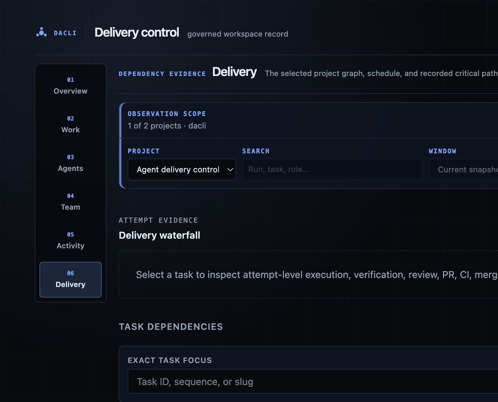
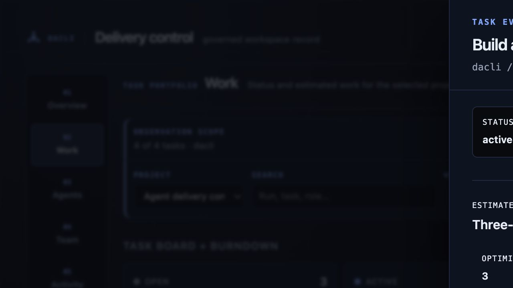

# Dashboard

`dacli dashboard` is the local, read-only projection over the same durable
workspace used by the CLI and MCP server. It does not keep a second database,
authorize transitions, or mutate tasks. Its job is narrower: make the current
delivery state understandable at a glance, then link an operator to the exact
evidence behind it.

```bash
dacli dashboard
# or pin the loopback port
dacli dashboard --port 8787
```

The command prints the local URL and serves only on loopback. Keep the terminal
open while using the page; press Ctrl+C to stop it.

## Navigate the workspace console

The dashboard opens at `#/overview` and exposes six stable read-only areas:

- **Overview** keeps the first decision compact: blocked work, pending events,
  live-agent/task totals, and project summaries.
- **Work** shows searchable task identities grouped by their truthful status
  counts, plus the selected project's burndown, without building its dependency
  graph.
- **Agents** shows measured token intensity and current run evidence.
- **Team** shows role authority, routing, model/runtime policy, scope, skills,
  WIP capacity, and the live agents occupying each role.
- **Activity** shows the durable pending-event count. It does not invent a
  chronology or apply an event; richer journal evidence belongs to the event
  projection.
- **Delivery** combines the selected project's dependency graph with a
  task-selected, attempt-level delivery waterfall.

Project and exact task selection are shareable, for example
`#/work?project=core&task=t-01TASK935` or
`#/delivery?project=core&task=t-01...`. Role
inspection is shareable too: `#/team?role=frontend-engineer` opens that exact
authority record. Unsafe identities and unknown paths are rejected without
loading hidden workspace data. Back, Forward, reload, and direct links all read
from the URL rather than a private browser-side stack.

### Scope an investigation

The observation strip keeps investigation context visible across routes. Its
controls are URL-backed, so a filtered view can be shared and browser
Back/Forward restores it exactly:

```text
#/agents?filter_role=frontend-engineer&runtime=codex&state=acting&range=24h
```

Overview and Delivery currently apply exact project scope. Work applies project
scope plus task identity/title/owner/priority/status search. Agents apply
search, role, runtime, state, and the 24-hour/7-day/30-day window to complete
live-agent observations; the window also bounds the displayed burn series.
Team applies search, role, runtime, and model. Activity keeps the context but
does not claim to apply filters until its typed event feed ships. Disabled
controls and the “preserved for another route” note make this boundary visible
instead of silently discarding or pretending to apply a filter.

The count at the left of the strip states filtered versus observed records.
**Pause** freezes automatic local observations, aborts in-flight reads, and
keeps the last good snapshot on screen. **Resume** restarts only the surfaces
required by the current route. Pausing the dashboard does not pause dacli, an
agent, GitHub, or any provider; the freshness label continues to age.

### Operator pulse

The Overview panel answers three lightweight questions before a focused area is
opened:

1. **Where is work moving?** The first active/open project and its counts.
2. **What needs attention globally?** Blocked tasks and pending durable events.
3. **What is moving?** Running-agent, active-task, open-task, and project totals.

“No recorded blockers” means the observed signals are within their recorded
overview contract. It is not a guarantee that route-specific burn, agent,
role, delivery, GitHub, or provider evidence is healthy.

### Work and Delivery

The project cards and Work board show status and estimated work. The board
loads one bounded task-row projection for the selected project, keeps the
server's total in every column, and filters exact id/title/owner/priority text
without turning a filtered count into the total. It never fetches detail once
per row.

Selecting a board row or visible dependency node opens the same read-only task
sheet keyed by exact task id. It lazy-loads `/api/task` and the task-scoped
`/api/events` page and shows status/priority/owner, the full three-point
estimate, narrative, acceptance boxes, typed resolved or dangling dependencies,
parent, newest-first task log, and recent durable events. Parent and dependency
links remain inside this inspection model. Missing or ambiguous records never
substitute another task; stale detail stays visible with its failed surface
named. The sheet exposes no transition, priority, acceptance, or dependency
mutation.

Delivery owns the heavier dependency graph. Both routes carry the same selected
project in the URL, but loading Work does not request or construct the graph.
The default **operational view** is selected on the server: unfinished tasks
matching the status filter, followed by only the completed ancestors needed to
explain those dependencies, capped at 120 nodes. The panel always states the
exact rule and visible/hidden node and edge totals; a bounded view is never
labelled as the complete history.

Exact task focus requests that task plus at most two predecessor/successor hops
and caps the neighborhood at 80 nodes. **Show completed history** is a separate
server-side projection, ordered deterministically in pages of at most 100
nodes. Status changes, focus, and page navigation re-fetch only `/api/graph`;
they do not transfer a full DAG and hide it in the browser. A missing or invalid
focus is an explicit 404/400, not an empty graph.

Every visible graph node is keyboard-focusable and opens task detail. On narrow
screens the same bounded result is a readable ordered task list before the SVG
canvas. The graph retains recorded critical-path markings, deterministic
layout, and its unscheduled/cycle note; edges are emitted only when both visible
endpoints exist, so an omitted node cannot produce a misleading dangling line.

Selecting a task in Delivery opens `delivery-attempt-timeline/v1`. Each run is
kept as a separate attempt and each phase is bound to current task generation,
run, commit/tree, and PR-generation identity where that evidence exists. The
desktop waterfall supports arrow, Home, and End navigation with exact evidence
tooltips; mobile renders the same spans as a compact ordered list. Missing
timestamps say **unknown duration**, never zero. Pending, failed, stale,
malformed, or skipped evidence is never promoted to green, and a corrupt phase
journal produces a visible refusal.

The projection exposes runtime/model choice, provider-reported usage, durable
phase source/freshness, verification contract, recovery state, and stable next
action. Exact-tree independent-review verdicts and bounded correction count come
from the review transaction; CI state comes from typed exact-head external
verification, where skipped, superseded, unobservable, stale-head, or failed
checks visibly refuse the phase. Current and superseded PR generations remain
separate. An unconsumed owner handoff and a merged-but-unaccepted task name the
next owner action instead of pretending the loop is merely idle. A terminal run
resumed from the durable phase journal is marked **Recovered**.

The projection deliberately excludes prompt and transcript contents, private
review findings, secrets, local paths, and hidden reasoning. Arbitrary handoff
and check labels pass through the public-safe sanitizer before rendering. Deep
links return to the task, agent, activity, or exact delivery selection without
adding browser-side workflow authority.

### Agents and spend

Burn compares measured run intensity with the calibrated ceiling. The swarm
view shows each recorded worker's task, role, runtime, state, last activity,
and resource observations. Transcript and diff links are read-only evidence
views backed by that run's durable record.

Every live row and mobile card has an explicit **Inspect agent** control. The
URL-owned sheet (`#/agents?agent=<id>`) lazy-loads only that exact durable agent
record—never one request per row—and shows role/grant authority, parent and
child lineage, current task ownership, and newest-first live/dead run history
with runtime, PID, start time, transcript, and diff evidence. Parent and child
identities stay inside the same inspection model; role and task references link
to their dashboard areas.

If a selected worker leaves the live swarm, its durable identity and history
remain visible as **retired** or **no longer live**. A failed refresh retains
the last good detail with a stale warning; a cold 400, 404, or server failure
names the exact unavailable record and can be retried independently. The sheet
has no kill, resume, grant, retry-run, or ownership controls.

`blocked`, `stalled`, and `silent` agents appear in the attention summary. The
dashboard does not kill, retry, or replace them. Use the CLI or MCP workflow so
the action remains governed and recorded.

### Team

The roster answers who may perform work: grant, runtime, model, scope, skills,
active workers, and WIP policy. Every row has an explicit **Inspect** control.
It opens a read-only authority sheet with the role's summary, phase kind,
grant, runtime/model, occupancy and cap, maximum task size, scope exclusions,
skills, shortcuts, escalation targets, standing-prompt status, and the live
agents assigned to that exact role. If a deep-linked role disappears, the
sheet names the missing identity instead of silently substituting another
role.

The sheet is a labelled modal dialog: Escape closes it, keyboard focus stays
inside while it is open, and focus returns to the Inspect control that opened
it. On narrow screens it becomes a full-width sheet. A role at its cap is an
explanation for why a new worker should not be scheduled, not an invitation to
bypass the cap in the browser; the inspector has no edit, spawn, or override
action.

## Freshness and failure states

The Vue page polls independent local API surfaces chosen by the active route.
Overview never fetches agent rows, burn history, the roster, or a graph. Agents
fetches overview/agents/burn and one agent detail only while selected; Team only overview/roles/agents, Work only
overview/projects/the selected project's task rows plus one selected task/event detail, and Delivery only overview/projects/the selected graph plus
the selected task's bounded timeline. Graph focus/status/history changes are
server-side projections within that one selected graph surface.
Leaving a route aborts its pending requests and late responses are ignored. The
legacy fallback still consumes the combined `/api/state` compatibility
snapshot.

The header reports whether the collection of surfaces is loading, live,
partially stale, or unavailable:

- **Loading** — no complete snapshot has arrived yet.
- **Live** — every required surface has a successful current observation.
- **Partially stale** — at least one surface retained its last good value after
  a failed or still-pending refresh; healthy sections remain live and usable.
- **Unavailable** — no trustworthy snapshot can be shown.

A stale snapshot on one surface keeps its last good value and names its own error; it does not
blank or disable unrelated sections. The generated timestamp is the newest
successful observation time, not proof that GitHub, a provider, or a worker has
not changed since then.

## Authority and security boundary

The HTTP server binds to `127.0.0.1` and accepts `GET` requests from recognized
loopback hosts. The API exposes workspace projections and bounded run evidence;
it has no write route. Use `dacli capabilities --json` to negotiate the live
CLI/MCP surface before an agent relies on a command.

The dashboard does not replace:

- `dacli explain --project <slug> --json` for sourced routing and next-action
  evidence;
- `dacli loop status --project <slug> --json` for durable recovery state;
- `dacli pr diagnose --task <ref> --json` for current GitHub/CI diagnosis; or
- the explicit verify, review, accept, and ship gates.

## Responsive and accessible use

Desktop uses a compact command bar and persistent six-area left rail, keeping
the route title and observation scope close to the viewport top. Below 1024px
the rail becomes an explicit grid; at 390px it is two rows of three 44px
targets rather than a hidden horizontal scroller. `aria-current` names the
selected area and route changes move focus to the new heading.

Live-agent and role evidence becomes stacked mobile cards below 768px. The
cards carry the same identity, state, runtime/model, task/scope, freshness/WIP,
and Inspect links as the desktop tables; they do not hide evidence merely to
fit. Task/status and graph surfaces keep their bounded card/list fallbacks.
All status colors have text labels, the page honors reduced-motion
preferences, and no route may widen the page at 390px. Use the skip link to
move directly to dashboard content.

## Troubleshooting

- **The page is empty:** run the command from a repository adopted into the
  intended dacli workspace and inspect the printed URL.
- **The page is stale:** keep the last snapshot as evidence, inspect the error
  in the header, and retry. Do not treat stale data as launch authority.
- **A run link returns 404:** the run may have been reconciled or its durable
  record may be unavailable. Use the CLI's run and journal views.
- **The released binary shows the legacy page:** release builds embed the Vue
  bundle. Source builds that skip the frontend build can fall back to the
  legacy self-contained page; see the
  [frontend README](https://github.com/mlnomadpy/dacli/blob/main/internal/features/dashboard/ui/README.md).

The desktop bounded-graph/task-explorer and 390px dependency-list screenshots
on the landing page use the representative test fixture in the repository,
scaled to the audited 553-task graph shape. They demonstrate route layout,
bounded density, and states—not production usage metrics.





The retained [agent lineage](assets/dashboard-agent.png) and
[390px role authority](assets/dashboard-mobile.png) captures document the other
inspection surfaces; the current
[390px dependency list](assets/dashboard-graph-mobile.png) documents the graph's
mobile fallback.
