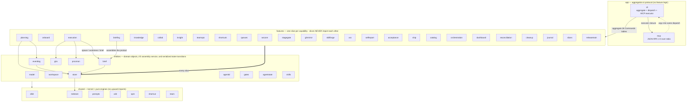
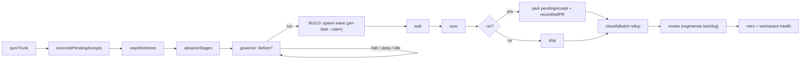

# Architecture diagrams

Three views of the system **as it exists now**, drawn from the code rather than the design that preceded it: a **component** view (how the packages layer), a **sequence** for one task's life from spawn to landing, and the **task lifecycle** state machine.

Each diagram is checked against the code it depicts. Every edge is backed by a `file:line` citation in the table beneath its diagram — that is what keeps the picture from drifting silently from the system, and it is why the diagrams live here as Mermaid text (they diff in review) rather than as an exported image.

> **Normative alignment.** [ARCHITECTURE.md](ARCHITECTURE.md) § 2b defines the feature-slice rules and this diagram enumerates the current slices. `brief` is an **I/O assembly service**, not an L4 pure engine: it reads workspace entities and renders the brief. The diagram also includes the entities that own serialized state transitions; append-only events avoid most contention, while scoped locks protect shared transitions. `internal/cli/arch_test.go` enforces slice isolation and `internal/cli/diagrams_test.go` keeps this inventory complete.

---

## 1. Component view — the feature-sliced layers

Dependencies point **downward only**: `app` → `features` → `entities` → `shared`. Two rules are enforced as tests, not honored by convention (`internal/cli/arch_test.go`): **slices never import each other**, and the **app layer never reaches past the kernel into entities**.



### Edges → code

| Edge | Where it lives |
|---|---|
| `cli` imports & aggregates all 26 slice `Commands` tables + `mcp serve` | `internal/cli/cli.go` |
| Dispatch: `Main` → `match` (longest-path-first) → `invoke` (gates + handler) | `internal/cli/cli.go:101-163`, `:266-279` |
| `mcp` never imports `cli`; `cli` hands it an `Executor` closure over the same dispatch | `internal/mcp/mcp.go:22-25`, `internal/cli/cli.go:316-352` |
| 20 core MCP tools + `cli` escape hatch, argv into the same table (no drift) | `internal/mcp/tools.go` |
| **Slice isolation** enforced (feature→feature import fails the build) | `internal/cli/arch_test.go:15-44` |
| **App-layer thinness** enforced (`cli.go` may not import store/eventlog/brief/spm) | `internal/cli/arch_test.go:49-61` |
| `briefing` and `execution` and `vcs` are the only slices that import `brief` | `internal/features/briefing/briefing.go:343`, `execution/execution.go:364`, `vcs/lifecycle.go:120` |
| `store` over `mdstore` (parse/render, atomic writes); `eventlog` append-only over `store` | `internal/store/store.go`, `internal/eventlog/eventlog.go:87` |
| Serialized state transitions: task/sequence, queue/stage, GitHub push, and worktree reclaim use scoped locks | `internal/store/store.go:878-927`, `internal/features/queues/transitions.go:33`, `internal/features/stagegate/transitions.go:33`, `internal/features/ghmirror/ghmirror.go:255`, `internal/features/vcs/vcs.go:294` |
| `brief` is the I/O assembly service over store, eventlog, prompts, risks, glossary, and notes | `internal/brief/brief.go:62-160` |

The 26 feature slices, one line each:

| Slice | Capability | Slice | Capability |
|---|---|---|---|
| `wscore` | init + workspace identity | `stagegate` | project templates + stage gates |
| `onboard` | adopt dacli into an existing repo | `ghmirror` | GitHub projection (local md is source) |
| `planning` | projects, tasks, risks, glossary | `skillforge` | compile skills per runtime |
| `briefing` | the context/brief **product** | `vcs` | commit/blame/pr/merge/integrate |
| `knowledge` | notes, retros, prompt audit | `selfreport` | file upstream bugs against dacli |
| `collab` | sync, ask/answer, escalate | `acceptance` | `dacli accept` (verify + close) |
| `insight` | status, lint, doctor, standup, SPM | `ship` | one-command wave tail |
| `teamops` | identities, roles, routing | `catalog` | render role/skill roster |
| `shortcuts` | memoized guarded commands | `orchestration` | the governed perpetual `loop` |
| `queues` | owned-cursor checklists | `dashboard` | read-only local web UI |
| `execution` | adapters, spawn, supervise, runs | `reconciliation` | canonical read-only delivery-state projection |
| `cleanup` | immutable safe repository-cleanup plans | `journal` | append-only event reconciliation + recoverable archival |
| `slices` | independently landable child-task delivery slices | `releasetrain` | resumable checks-gated branch promotion |

---

## 2. Sequence — spawn through landing

One task, from the loop launching an agent to the branch reaching trunk. The **gates** all refuse with **exit 3** (a policy "no", never retried); the child's writes reach the owner because a worktree agent's dacli state resolves to the **shared** root, not its worktree's stale `.dacli`.

```mermaid
sequenceDiagram
    participant Loop as loop / root
    participant D as dacli (spawn)
    participant G as launchGates
    participant RT as runtime
    participant Ch as child agent
    participant Git as git / remote (gh)
    participant St as eventlog + store

    Loop->>D: spawn --task --role --detach --worktree --claim
    D->>G: resolveLaunch runs launchGates in order
    Note over G: role-wip · seniority · phase ·<br/>token-budget · taint · claim-overlap<br/>(any fail → exit 3)
    G-->>D: cleared to launch
    D->>Git: gitx.AddWorktree → branch dacli/NNN-slug
    D->>St: mint identity · stamp claim · freeze brief
    D->>RT: execRuntime (sandbox + env allowlist)
    RT->>Ch: run with frozen brief + worktree preamble

    Ch->>Git: dacli commit (author = agent, on its branch)
    Ch->>St: EventCommit crumb
    Ch->>St: task done → EventProposeStatus "propose: done"

    Loop->>D: wait (block until wave finalizes)
    Loop->>D: sync (owner applies pending events)
    D->>St: apply propose:done → verify boxes → CloseTask

    alt --pr (controller-owned PR)
        Loop->>Git: push canonical branch + create/reuse PR
        opt persisted auto_merge=true
            Loop->>Git: queue auto-merge behind required checks
        end
        Loop->>D: recordSelfPR (holds push while a PR is in flight)
        Note over Loop,Git: next cycle: reconcilePendingAccepts
        Loop->>Git: prLandStatus == merged?
        Loop->>D: accept --force → close record (only after merge)
    else --no-pr (local)
        Loop->>D: ship
        D->>Git: integrate / merge branch into trunk
    end
```

### Edges → code

| Step | Where it lives |
|---|---|
| `cmdSpawn` → `resolveLaunch` builds the fully-gated plan | `internal/features/execution/execution.go` |
| Provider process/stream lifecycle behind `runtimeLauncher` | `internal/features/execution/provider_runtime.go` |
| Runs, agents, logs, and sourced progress projection | `internal/features/execution/observability.go` |
| Detached wait/finalization and durable lifecycle evidence | `internal/features/execution/lifecycle.go` |
| `launchGates` — the single ordered gate list (WIP, seniority, phase, token-budget, taint, claim-overlap) | `internal/features/execution/execution.go` |
| `gateRoleWIP` / `gateTaint` / `gateClaimOverlap` refusals (exit 3) | `internal/features/execution/execution.go` |
| `sandboxFor` grant check (rw needs a write-capable runtime; ro needs an enforcer) | `internal/features/execution/execution.go` |
| `preflightIssues` — grant/binary-allowlist/prompt-tools, all in one pass | `internal/features/execution/preflight.go:58-88`, called at `execution.go:487` |
| Worktree creation + `worktreePreamble` (state resolves to shared root) | `execution.go:703-726`, `:891` |
| `dacli commit` (rw-gated, refuses main, claim-scoped) + `EventCommit` crumb | `internal/features/vcs/vcs.go:69-127`, `:178` |
| `task done` (non-owner) files `EventProposeStatus "propose: done"` | `internal/features/planning/planning.go:433` |
| `wait` → `sync` → owner applies proposal, verifies boxes, `CloseTask` | `orchestration.go:712`, `:725`; `internal/eventlog/sync.go:179-234` |
| `accept-propose:` comment is left pending by sync; consumed only by `dacli accept` | `internal/eventlog/sync.go:246-256`; `acceptance.go:163,189` |
| LAND: `--pr` parks in `pendingAccept` + `recordSelfPR`; `--no-pr` runs `ship` | `internal/features/orchestration/delivery_tail.go` |
| `reconcilePendingAccepts` closes only on confirmed merge (`prLandStatus`) | `internal/features/orchestration/delivery_tail.go` |
| `ship` pipeline: accept → integrate → record → push → optional release | `internal/features/ship/ship.go:72`, `:150-251` |
| record commit to a separate ref (code-only trunk) or staged `.dacli` on trunk | `internal/features/ship/ship.go:294-349` |

### The loop's cycle (the caller of the sequence above)

`runCycle` walks one sprint; the phases are all real `dacli` subcommand invocations, sequenced by the driver:



| Phase | Call site |
|---|---|
| `syncTrunk`, `reconcilePendingAccepts`, `reapWorktrees`; ready-frontier scheduling; governor `Before` | `delivery_tail.go`; `scheduling.go`; `orchestration.go` |
| BUILD (spawn per task) · wait · sync | `orchestration.go:703`, `:712`, `:725` |
| LAND (`recordSelfPR` or `ship`) · rollup · review · retro | `delivery_tail.go`; `orchestration.go` |

---

## 3. Task lifecycle — the states a task moves through

Status is **folder-derived** (`tasks/open|active|blocked|done/`), never frontmatter — the folder wins. There are exactly four states; **"accepted" is not a state**, it is a close *path* into `done`. A non-owner can only *propose* a transition (an append-only event); the **owner applies it on sync**.

```mermaid
stateDiagram-v2
    [*] --> open: task add<br/>(near-dup → exit 3 unless --force)
    open --> active: task claim (owner)
    active --> blocked: ask / task block (owner)
    blocked --> active: answer (owner) · sync unblock
    active --> active: task check (owner only)<br/>(non-owner → exit 3)
    active --> done: task done / accept (owner)<br/>[all boxes checked; else exit 3]
    done --> [*]

    note right of active
        Non-owner path: append an event, do NOT move.
        task done → EventProposeStatus "propose: done"
        accept    → EventComment "accept-propose:"
        Owner applies on sync / accept.
    end note

    note right of done
        --pr: the record is held OPEN in pendingAccept
        until the PR MERGES; close (accept --force) never
        precedes trunk landing (issue #74 / #382).
        A PR that closes unmerged → back to the ready pool.
    end note
```



### Transitions → code

| Transition | Command · guard | Where it lives |
|---|---|---|
| `∅ → open` | `task add`; near-duplicate refused unless `--force` (exit 3) | `planning.go:164`, `:195`; `store.CreateTask` `store.go:396` |
| `open → active` | `task claim` (owner sets owner + `MoveTask`); owned+active → exit 3 | `planning.go:319-359`, `:338-340` |
| non-owner claim | appends `EventClaim`; "owner applies it on sync" | `planning.go:341-348` |
| `active → blocked` | `ask` / `task block` (owner) → `MoveTask(StatusBlocked)` | `collab.go:86-123`; `planning.go:514-554` |
| `blocked → active` | `answer` (owner); `EventBlock`/unblock applied on sync | `collab.go:195-203`; `internal/eventlog/sync.go:263-271` |
| `active → active` | `task check` — **owner only** checks boxes (non-owner → exit 3) | `planning.go:364-382` |
| `active → done` (owner) | `task done`: empty-acceptance → exit 3; any unmet box → exit 3; else `CloseTask` | `planning.go:403-465`, `:428-430`, `:448-450`; `store.CloseTask` `store.go:1249` |
| `active → done` (owner) | `accept`: empty/require-verify/require-independent/unlanded guards, then `CloseTask` | `acceptance.go:116-193`; `internal/features/vcs/lifecycle.go:395` (landing check) |
| non-owner done / accept | `EventProposeStatus "propose: done"` / `EventComment "accept-propose:"` | `planning.go:433`; `acceptance.go:98-111` |
| owner applies `propose: done` | sync mirrors the owner close (verifies boxes, else stays pending) | `internal/eventlog/sync.go:179-234` |
| root reconcile | `accept --force` adopts an orphaned task, then closes | `acceptance.go:80-91` |
| PR merged / unmerged (loop, `--pr`) | merged → `accept --force` close; unmerged → drop back to ready pool | `orchestration.go:897-920` |

The exit-code contract these guards obey: **2** usage, **3** refused-by-policy (never retry), **4** not found, **1** everything else — `internal/clikit/clikit.go:67-110`.
