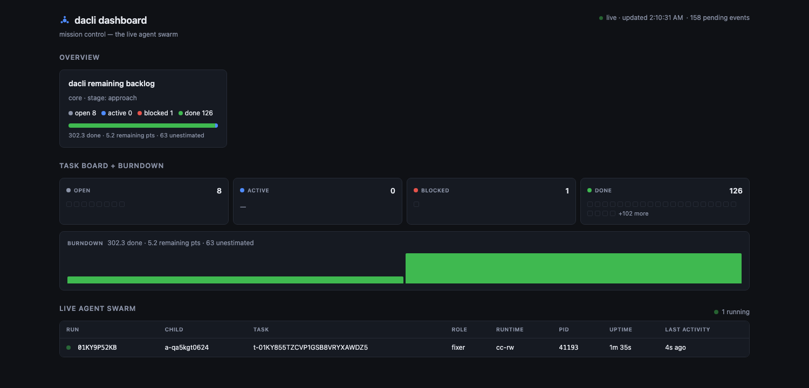

# dacli

<p align="center">
  
</p>

<p align="center"><strong>Your autonomous engineering team — set the direction; it plans, builds, reviews, and ships.</strong></p>

    

dacli is a disciplined swarm of specialized agents — implementers, reviewers, auditors, an integrator — that runs a repository the way a real engineering org does: sprints, PRs, code review, CI gates, retros. It self-hosts: **this tool built and hardened itself, across 80+ merged PRs**, tracked in its own `.dacli/` workspace (see [SELFHOSTING.md](SELFHOSTING.md)). The moat is governance — a loop that knows when to stop, review that audits its own code, trust/taint gates, calibrated budgets — which is what makes it safe to run unattended on real code.

```bash
brew install mlnomadpy/tap/dacli
```

<p align="center">
  
  <br>
  <em>mission control — the live agent swarm</em>
</p>

> Markdown on disk, folders for structure, a CLI and an MCP server as the two front ends. Zero dependencies outside the Go standard library.

An agent that spawns subagents has one hard problem: **each child starts blind.** It re-reads the codebase, re-derives decisions its siblings already made, and re-attempts work that already failed. `dacli` is the shared workspace that fixes this — a durable, human-readable project state that any agent in the tree can query, and that the parent can slice down to exactly the context a given child needs.

Everything is markdown with YAML frontmatter and `[[wikilinks]]`. That means git diffs it, `grep` searches it, GitHub renders it, Obsidian opens the workspace as a vault with no plugin, and you can fix it by hand when an agent writes something stupid.

## What you get

|  | |
|---|---|
| 🧠 **Context on tap** | `dacli context <task> --budget N` returns one self-contained, token-budgeted brief — task, goal, constraints, prior decisions, siblings' findings — instead of the whole repo. |
| 🚀 **A real agent fleet** | `spawn` launches child coding-agent CLIs; `--claim` reserves disjoint files; `--detach` + `wait` run them async; `accept` closes a task after verifying it; `ship` ties off a whole wave. |
| 📊 **Measures its own cost** | `calibrate` learns each *role × model × runtime*'s real cost — in **tokens**, not guesses — then `spawn --advise` / `--max-tokens` size and gate the next launch by it. |
| 🛡️ **Trust & safety gates** | Every brief carries a **trust-floor**; `taint` refuses to spawn onto an injected source's blast radius; a `--claim` conflict is refused before it can clobber a sibling. |
| 🔎 **Resource-safe** | `agents` shows each live tree's RAM/CPU/GPU + last transcript line; `kill` reaps the whole process group — no runaway agents. |
| 🔗 **GitHub, both ways** | `github push` mirrors tasks→issues, decisions→issues, findings→issues (severity-labeled); `github pull` adopts issues as tasks — all behind a disclosure gate. |
| 📓 **Everything recorded** | Every run freezes its brief, invocation, transcript, and outcome; every commit is attributed to the agent and role that authored it. |

## Install

**Homebrew** (macOS/Linux):

```bash
brew install mlnomadpy/tap/dacli
```

**Direct download** — prebuilt darwin/linux/windows binaries (amd64+arm64) are attached to each [GitHub release](https://github.com/mlnomadpy/dacli/releases):

```bash
curl -sSL https://github.com/mlnomadpy/dacli/releases/latest/download/dacli_<version>_<os>_<arch>.tar.gz | tar xz
```

**From source** (requires Go 1.22+):

```bash
go install github.com/mlnomadpy/dacli/cmd/dacli@latest
```

## Quickstart

```bash
# In your project root
dacli init --name "payments-refactor"

dacli project add "Migrate billing to the new ledger" --slug ledger
dacli task add "Audit every write path into balances" --project ledger
dacli note add decision "Ledger writes stay synchronous" --project ledger \
  --body "Async was rejected: reconciliation cost exceeds the latency win."

# Parent agent mints a read-only child identity
TOKEN=$(dacli agent spawn --role auditor --grant ro)

# Child agent, in its own process
DACLI_AGENT=$TOKEN dacli context task/001 --budget 3000
DACLI_AGENT=$TOKEN dacli status
```

## Where to go next

- Start with the [documentation index](README.md) for the full reading order.
- [Architecture](ARCHITECTURE.md) is the normative spec — axioms, layers, build order, the canonical brief.
- [Walkthrough](WALKTHROUGH.md) traces one task end to end through the whole system.
- The source lives at [github.com/mlnomadpy/dacli](https://github.com/mlnomadpy/dacli); [DESIGN.md](https://github.com/mlnomadpy/dacli/blob/main/DESIGN.md) is the project's original contract.

## License

MIT
