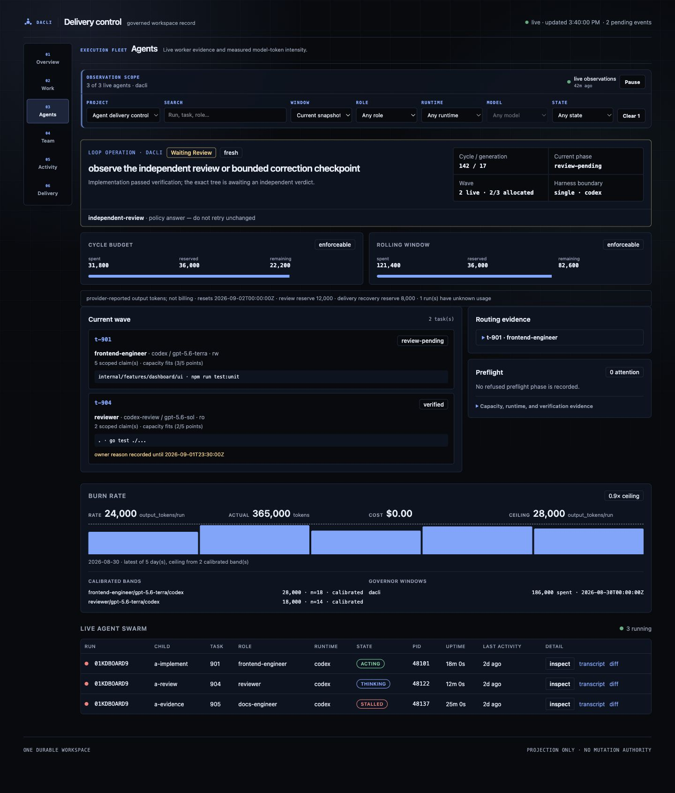

<!-- The home page is rendered by overrides/home.html (a custom conversion
     landing). This markdown is a fallback and is not shown on the site. -->

# dacli

<p align="center">
  
</p>

<p align="center"><strong>The control plane for autonomous coding-agent swarms.</strong></p>

    

Give an orchestrator AI agent a product direction. dacli gives it durable
context, critical-path planning, isolated execution, model routing, budgets,
recovery, and verified GitHub landing across Codex, Claude Code, Gemini CLI,
Copilot CLI, and generic executable adapters.

Pin the harness already selected for the project (`--harness codex`, for
example). Model/cost routing stays inside that harness; cross-CLI execution is
enabled only by an explicit multi-harness allowlist plus `--hybrid`.

```bash
go install github.com/mlnomadpy/dacli/cmd/dacli@latest
```

> [v0.3.1](https://github.com/mlnomadpy/dacli/releases/tag/v0.3.1) and later
> tagged releases provide prebuilt binaries, SBOMs, and checksums. A Homebrew
> formula is not currently shipped.

<p align="center">
  
  <br>
  <em>representative workspace state — bounded loop and outcome evidence, never inferred authority</em>
</p>

> Markdown on disk, folders for structure, a CLI and an MCP server as the two front ends. Zero dependencies outside the Go standard library.

An agent that spawns subagents has one hard problem: **each child starts blind.** It re-reads the codebase, re-derives decisions its siblings already made, and re-attempts work that already failed. `dacli` is the shared workspace that fixes this — a durable, human-readable project state that any agent in the tree can query, and that the parent can slice down to exactly the context a given child needs.

Everything is markdown with YAML frontmatter and `[[wikilinks]]`. That means git diffs it, `grep` searches it, GitHub renders it, Obsidian opens the workspace as a vault with no plugin, and you can fix it by hand when an agent writes something stupid.

## One governed product-building loop

```text
direction → plan and route → execute and review → verify and land → learn ↺
```

- **Human governor:** direction, credentials, exceptions, emergency stop, and
  release policy.
- **Orchestrator agent:** goal interpretation, decomposition, prioritization,
  and product or architecture judgment.
- **dacli:** durable state, policy, routing, budgets, agent lifecycle, recovery,
  and landing requirements.
- **Coding-agent CLIs:** isolated implementation, review, and testing.
- **GitHub:** visible issues, PR review, CI, merge, and release evidence.

## What the control plane provides

|  | |
|---|---|
| 🧠 **Context on tap** | `dacli context <task> --budget N` returns one self-contained, token-budgeted brief — task, goal, constraints, prior decisions, siblings' findings — instead of the whole repo. |
| 🚀 **Replaceable coding CLIs** | Route by capability, cost, context, and health across supported runtimes without changing the workflow. |
| 📊 **Measures its own cost** | `calibrate` learns each *role × model × runtime*'s real cost — in **tokens**, not guesses — then `spawn --advise` / `--max-tokens` size and gate the next launch by it. |
| 🛡️ **Bounded autonomy** | Claims, grants, token windows, trust gates, stop conditions, and recovery journals make every autonomous cycle explicit and inspectable. |
| 🔎 **Resource-safe** | `agents` shows each live tree's RAM/CPU/GPU + last transcript line; `kill` reaps the whole process group — no runaway agents. |
| 🔗 **GitHub, both ways** | `github push` mirrors tasks safely by default on public repos; internal findings/decisions need separate authority and an explicit request. `github projection --json` exposes the typed policy; `github pull` adopts issues as tasks. |
| 📓 **Everything recorded** | Every run freezes its brief, invocation, transcript, and outcome; every commit is attributed to the agent and role that authored it. |

## Install

**From source** (requires Go 1.22+):

```bash
go install github.com/mlnomadpy/dacli/cmd/dacli@latest
```

**Direct download** — prebuilt darwin/linux/windows binaries (amd64+arm64)
and `checksums.txt` are attached to each
[GitHub release](https://github.com/mlnomadpy/dacli/releases):

```bash
mkdir dacli-v0.3.1
gh release download v0.3.1 --repo mlnomadpy/dacli --dir dacli-v0.3.1
cd dacli-v0.3.1
shasum -a 256 -c checksums.txt # use sha256sum -c on Linux
```

Verify the archive against the release's `checksums.txt` before installing it.
Homebrew is not currently shipped; the documentation will publish the exact
tap command only when that distribution channel exists.

```bash
dacli version --compatibility --json
dacli capabilities --json
```

Those commands negotiate installed agent guidance against the live CLI/MCP
surface; do not infer compatibility from the release number alone.

## Start through one operating profile

```bash
# In the target repository
dacli adopt --provision-roles

# Inspect the resolved roles, runtimes, budgets, verification, and landing policy
dacli start --project <slug> --profile loop --dry-run

# Run bounded, governed cycles using that same resolved policy
dacli start --project <slug> --profile loop
```

## Where to go next

- Start with the [documentation index on GitHub](https://github.com/mlnomadpy/dacli/blob/main/docs/README.md) for the full reading order.
- [Architecture](ARCHITECTURE.md) is the normative spec — axioms, layers, build order, the canonical brief.
- [Operator playbook](OPERATOR_PLAYBOOK.md) chooses task, wave, loop, or service
  boundaries and shows the recovery path.
- [Walkthrough](WALKTHROUGH.md) traces one task end to end through the whole system.
- [Dashboard](DASHBOARD.md) explains the local read-only operator view and its freshness boundary.
- [Hosted control-plane status](CONTROL_PLANE.md) separates the runnable
  API/worker infrastructure skeleton from the Phase 1 domain work that is not
  shipped. The [decision](decisions/0001-control-plane-boundary.md), threat
  model, and privacy contract govern that work.
- The source lives at [github.com/mlnomadpy/dacli](https://github.com/mlnomadpy/dacli); [DESIGN.md](https://github.com/mlnomadpy/dacli/blob/main/DESIGN.md) is the project's original contract.

## License

[BSD 3-Clause](https://github.com/mlnomadpy/dacli/blob/main/LICENSE).
Copyright © 2026 Taha Bouhsine.
